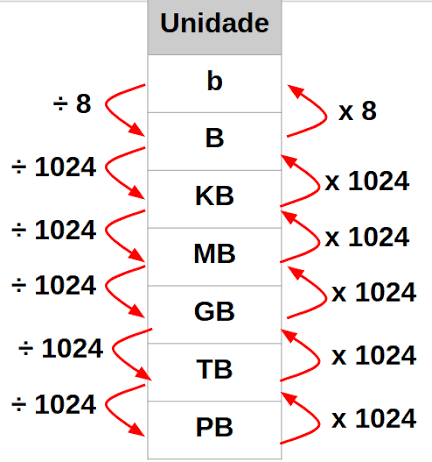
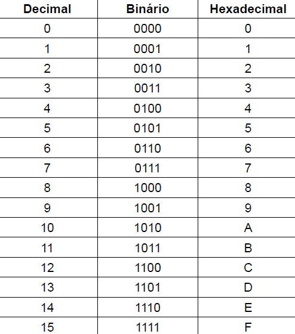

# REPRESENTAÇÃO DA INFORMAÇÃO
## Objetivo: 
Entender como um computador representa qualquer tipo de informação, usando apenas dois estados elétricos (linguagem binária).
## Bit (b) (binary digit)
Os computadores não entendem a linguagem humana como conhecemos, eles usam a linguagem binária que envolvem 0´s e 1´s, os quais representam estados físicos.  
(exemplo, 0 = sem/pouca corrente elétrica; 1 = com corrente elétrica).
- São a menor unidade de informação que um computador consegue armazenar
- Só podem assumir os estados de 0 ou 1
- nº de possibilidades = 2 possibilidades
## Bytes (B)
São agrupamentos de **8 bits**.
- São considerados o valor base de referência internacionalmente
- 1 byte = 256 possibilidades de combinações = 2^8 (8 bites cada um com duas possibilidades (0 e 1))
### Múltiplos do Byte
- Temos múltiplos do **Byte** que são usados para representar grandes quantidades de armazenamento.
- A partir da unidade **Byte** em diante a conversão acontece baseado na quantidade de 1024, pois a linguagem binária tem base 2 e 1024 = 2^10.

### **Segue um esquema de conversão entre os múltiplos:**

# SISTEMA BINÁRIO, DECIMAL E HEXADECIMAL
- Os sistemas tem suas bases (quantidade de símbolos que são usados para representar todos as quantidades possíveis a partir de sua reorganização).
- É possível converter quantidades entre os diferentes tipos de sistemas (as conversões mais usadas são binário <-> hexadecimal)
### Sistema Binário
- Tem base 2 (apenas dois símbolos 0 e 1)
### Sistema Decimal
- Tem base 10 (10 símbolos (0,1,2,3,4,5,6,7,8 e 9))
### Sistema Hexadecimal
- Tem base 16 (isso inclui todos os números do sistema decimal e as 6 primeiras letras do alfabeto (0,1,2,3,4,5,6,7,8,9,A,B,C,D,E e F))
- Muito usado para facilitar a representação dos binários
- 1 hexadecimal = 4 bits 
- 2 hexadecimais = 8 bits = 1 byte

### **Tabela de valores/conversão entre sistemas:**

# ASCII, Unicode e UTF-8
### ASCII
Foi criado para representar cada caracter por um número (ex:. A = 65). Baseado no inglês, logo não inclui acentos, emojis, etc (Isso representa uma falha).
### Unicode 
Criado para dar um código único para todos os caracteres que existem, logo inclui tudo do ASCII junto com acentos, emojis, outros idiomas, etc.
### UTF-8
Usado para gerenciar a forma como os caracteres Unicode são armazenados em bytes:

    - 1 byte → caracteres ASCII
    - 2 bytes → muitos caracteres europeus
    - 3 bytes → diversos alfabetos
    - 4 bytes → emojis e alguns símbolos especiais
### Fluxo de Funcionamento 
Caractere → Unicode → UTF-8 → Bytes → Bits

## **DICAS:**
- As conversões mais usadas são (domine elas e você vai conseguir suprir 90% da demanda do mercado):
    - Binário <-> Hexadecimal
    - Binário <-> Decimal

    